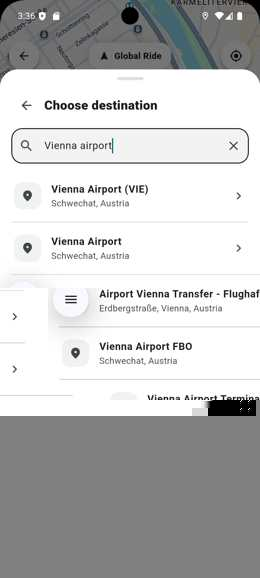

# Global Ride Platform — Engineering Showcase

> **What if ride-hailing could be built around more predictable economics for the people doing the driving?**
>
> Global Ride is a working product prototype exploring that question — with a real passenger-to-driver journey already implemented across Flutter, FastAPI and Google Maps.

[](https://flutter.dev/)
[](https://fastapi.tiangolo.com/)
[](https://mapsplatform.google.com/)


## The story

Ride-hailing looks simple from the passenger seat: choose a destination, request a car, arrive. Behind that interaction is a marketplace that must keep passengers, drivers, operators and the platform economically aligned.

Global Ride started from a business question rather than a UI exercise: **can the platform relationship be designed differently while still delivering the experience users expect?**

The first step was to build the product loop and make it tangible. The current prototype takes a passenger from destination search and route pricing through driver matching, pickup, ride completion, rating, tip, payment selection and receipt. A separate driver experience handles incoming requests and the operational ride lifecycle.

The next step is validation: testing the commercial model, unit economics and go-to-market assumptions against real market conditions. No public claim is made here about traction, revenue or production scale that has not yet been demonstrated.

This repository is intentionally a **showcase, not a source-code mirror**. It reveals the product, architecture and engineering decisions while keeping implementation details and commercially sensitive logic private.


## Product thesis

Most ride-hailing platforms monetize activity as it happens. Global Ride is exploring whether a more predictable platform-cost relationship can create stronger alignment for active drivers and operators while still funding a sustainable marketplace.

That is a **hypothesis to validate**, not a claim of proven superiority. The public showcase deliberately does not publish the detailed pricing formula, internal unit-economics model or commercialization logic.

### Why this is worth testing

- Driver economics are directly affected by platform fees and utilization.
- A marketplace still needs enough revenue to fund acquisition, support, payments, safety, infrastructure and operations.
- Lower fees alone are not a moat: liquidity, reliability, trust and distribution matter.
- Therefore the opportunity is not simply to be "cheaper" — it is to test whether a different economic relationship can improve alignment without weakening the marketplace.

### Market reality check

For one concrete benchmark, Bolt currently publishes an **18% commission in Austria**. That makes platform economics a measurable driver-side cost rather than an abstract product question. Global Ride's commercial model is being evaluated against real market structures like this, not against an invented competitor model.

## What the project demonstrates

- Passenger and driver application modes
- Destination search and place autocomplete
- Google Maps integration, GPS/location handling and route computation
- Ride categories: Economy, Comfort and XL
- Ride request and driver acceptance workflow
- Persistent ride storage through SQLAlchemy/PostgreSQL-oriented data access
- Driver, operator, user and vehicle domain models
- Ride feedback with rating, tip and comments
- Payment/receipt domain flow implemented as demo infrastructure
- HTTP API communication between Flutter and FastAPI
- Modular backend structure with API, schemas, services, models and database layers

## Architecture

```text
┌─────────────────────────────────────┐
│            Flutter Client           │
│                                     │
│ Passenger UI        Driver UI       │
│ Maps • GPS • Search • Ride Flow     │
└──────────────────┬──────────────────┘
                   │ HTTP / JSON
                   ▼
┌─────────────────────────────────────┐
│          Python / FastAPI API       │
│                                     │
│ Places • Routes • Rides • Payments  │
└─────────┬───────────────┬───────────┘
          │               │
          ▼               ▼
┌─────────────────┐  ┌────────────────┐
│ Google Maps     │  │ Service / Data │
│ Places & Routes │  │ Access Layers  │
└─────────────────┘  └───────┬────────┘
                              ▼
                     ┌────────────────┐
                     │ SQLAlchemy /   │
                     │ PostgreSQL     │
                     └────────────────┘
```

## Technology stack

| Layer | Technologies |
| --- | --- |
| Mobile / UI | Flutter, Dart, Material |
| Maps & location | Google Maps Flutter, Geolocator, Google Places & Routes APIs |
| API | Python, FastAPI, Pydantic |
| HTTP | Dart HTTP, HTTPX |
| Persistence | SQLAlchemy, PostgreSQL-oriented persistence |
| Local state | SharedPreferences |
| Domain | Passenger, Driver, Operator, Vehicle, Ride, Payment |
| Engineering workflow | Git, GitHub, AI-assisted development |

## Backend organization

The private implementation is organized around clear responsibilities:

```text
backend/
├── app/
│   ├── api/          # HTTP route modules
│   ├── core/         # shared utilities
│   ├── database/     # persistence and data-access layer
│   ├── models/       # domain models
│   ├── schemas/      # request/response contracts
│   └── services/     # maps, rides and payment logic
└── main.py           # FastAPI application
```

The Flutter application contains the passenger/driver experience, map interaction, destination workflow and API communication.

## Engineering decisions

**Server-side Maps access.** Sensitive server credentials are read from environment configuration rather than committed to source control. Places and route operations are exposed through backend endpoints.

**Persistent ride state.** Ride data is handled through a service/data-access layer rather than relying on in-memory application state.

**Separated domain concepts.** Users, drivers, operators and vehicles are represented independently so the model can evolve beyond a single-user prototype.

**Explicit API contracts.** Pydantic schemas define ride creation, acceptance, routing, feedback and payment-related requests.

## Current project status

**Stage: working prototype / pre-validation.**

Global Ride is not presented as a production transportation service and does not claim live-market traction. The current implementation demonstrates the application architecture and core ride lifecycle. Payment processing is intentionally demo infrastructure; no real card processor is connected.

The important distinction is that this is no longer only a concept: the product journey can be demonstrated end to end. The commercial thesis still has to earn its proof through market validation.

Areas intended for further development include authentication/authorization hardening, production payment integration, real-time event delivery, automated testing, deployment infrastructure and production observability.

## Screenshots & demo

### Passenger destination search

<p align="center">
  
</p>

The working demo includes the complete ride lifecycle: destination autocomplete, route calculation, Economy/Comfort/XL fare selection, driver matching, driver acceptance, pickup/arrival, ride start and completion, passenger rating and tip, payment selection, and receipt generation.

The screenshot above is captured from the running Android demo and shows the live destination-search flow for Vienna Airport.

## Public communication principles

Global Ride's public materials focus on its own product, hypotheses and demonstrated capabilities. Market examples are described generically and illustrative calculations are labelled as scenarios. The project does not make claims about the quality, conduct, motives or performance of identifiable competitors.

Business assumptions remain hypotheses until validated with observed data. Prototype capabilities are described as prototype capabilities; they are not presented as production scale, regulatory approval or commercial traction.

## Two reasons to start a conversation

### For engineering teams

The project demonstrates product-oriented engineering across mobile UI, backend APIs, maps/location services, domain modelling and end-to-end workflow validation. **Full source code is maintained privately and can be made available for controlled technical review upon request.**

### For investors & strategic partners

The interesting question is larger than the prototype: **can a different platform-cost model create a ride-hailing marketplace with better alignment while preserving sustainable platform economics?** Detailed unit economics, pricing mechanics and pilot assumptions are intentionally kept outside the public repository and can be discussed privately.

> **Public by design:** product story, working flows, high-level architecture and demonstrated capabilities.  
> **Private by design:** complete source, credentials, internal APIs, detailed pricing logic, unit-economics model and commercially sensitive implementation.

## About the developer

Built by **Bogdan Dulgheru** as a portfolio engineering project focused on Python, AI-assisted software development, backend architecture and cross-platform application development.

AI coding tools are used as part of the engineering workflow while architecture, validation, testing and final implementation decisions remain developer responsibilities.

---

### Why this repository is public

The goal of this repository is to let recruiters and engineering teams evaluate the project's scope, architecture and engineering decisions without publishing the complete implementation or sensitive configuration.